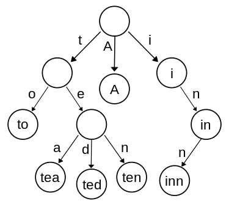

# Trie

## Дефиниция

Trie (произнася се както "try"; идва от re**trie**val) е структура от данни, която главно се използва за запазване на речници от думи. Главното предимство е проверката дали дума принадлежи на речника за време O(m), където m е дължината на думата. С обикновен масив от думи тази проверка става за време O(nm), а с сортиран масив или двоично наредено дърво - за време O(mlog(n)).

### Структура

Trie-ят се представя като дърво, в което връзките между върхове са букви и пътят до някой връх от корена представлява самата дума.

#### Пример


В Trie-a от примера се съдържат думите "A", "to", "tea", "i", "in", "inn", "ten", "ted". Забележете, че думите "t" и "te" не се съдържат в речника, но те ни трябват като префикси на думи от речника.

### Проверка за съдържане на дума

При проверка дали дума се съдържа в речника започвате да обхождате дървото от корена. Четете една по една буквите от думата, като за всяка прочетена буква отивате в съответния наследник на текущия връх, ако съществува такъв. Ако сте прочели цялата дума и тя е в речника, връщате "истина".

### Добавяне на дума

По същия начин обхождате дървото, само че ако стигнете до връх, от който няма наследник със съответната буква, създавате нов наследник с буквата. И така докато не прочетете цялата дума.

### Търсене по префикс

Интересното нещо за Trie-a е, че в него се пазят всички префикси на думите в него(дори самите те да не участват в речника). Благодарение на това лесно можем да изведем всички думи започващи с един и същ префикс.

Ако търсим всички думи с префикс "te" в примера, ще намерим думите "tea", "ten", "ted", а ако префикса е "in", думите са "in" и "inn".

Подобна хватка се използва при auto-complete в телефоните. Въпреки че, там се използва и статистически анализ, за да се препоръчват думи, които е по вероятно да бъдат използвани. Например в изречението "Thirsty for some hot te..." е по-вероятно да се използва думата "tea", а не другите две.

## Spell-checking

Хорътъ не омейат да пишът правелну (мен ме боли повече да го пиша, отколкото вас да го четете). Един начин да се поправят думи е да се намерят подобно изглеждащи думи в речника и да се заменят грешните с правилни. Но по какъв начин дефинираме подобни думи?

### Levenstein Distance

Един начин се нарича Левенщайн разстояние. При него се дефинират прости коригиращи операции. Най-популярните са:

* премахване на една буква
* добавяне на една буква
* промяна на някоя буква с друга от азбуката

Тогава Левенщайн разстоянието между две думи е минималният брой операции нужни за трансформирането на едната дума в другата.

Пример:
```c++
distance(Kappa, Kapp) = 1; // махаме последната буква.
distance(Kapp, Kappa) = 1; // Добавяме 'а' накрая.
distance(Kappo, Kappa) = 1; // Замяна на 'о' с 'а'. Забележете, че можете първо да премахнете 'о' и после да добавите 'а' накрая и тогава стават 2 операции. Нас обаче ни интересува минималният брой операции.
distance(Kamma, Kappa) = 2; // Замяна на двете 'm'-ове с две 'p'-та
```

### Пресямтане на Levenstein Distance

Дадени са два низа А и B с дължини съответно n и m. Дефинираме Lev(a,b)(i, j) като Левенщайн разстоянието между първите i букви на А и първите j букви на B. Тогава:

```
Lev(a,b)(n,m) = Lev(a,b)

Lev(a,b)(i,j) =
    | max(i, j), if min(i,j) = 0; // Едната дума е празна, затова просто добавяме всички букви на другата дума или махаме всички букви другата.
    | min(
    |       Lev(a,b)(i-1, j) + 1; // Махаме 1 буква от първата дума и после използваме Lev(a,b)(i-1, j) операции, за да стигнем другата.
    |       Lev(a,b)(i, j-1) + 1; // Използваме Lev(a,b)(i, j-1) корекции за да стигнем първите j-1 букви на втората дума и после добавяме j-тата
    |       Lev(a,b)(i-1, j-1) + a[i] == a[j] ? 0 : 1; // Трансформираме първите i-1 букви на първата дума в първите j-1 на втората и после, ако a[i] == j[i], нищо не правим, иначе правим една корекция.
```

С чиста рекурсия това би било адски бавно (защо?), затова ще използваме техниката динамично програмиране(или мемоизация), която използваме старите вече сметнати решения в текущото.

* създаваме таблица n на m - lev.
* lev[i][j] = Lev(a,b)(i,j)
* Запълваме ред 0 и колона 0 на таблицата.
* Попълваме останалата таблица ред по ред и така всяка стойност само по веднъж ще се смята.

По този начин постигаме времева сложност O(nm), което е доста хубаво в случая.

#### Пример


Помислете дали е нужно да пазим цялата таблица.

### Използване на Trie за пресмятане на Levenstein Distance за целия речник

Показахме как се пресмята разстоянието между две думи, обаче да го пресмятате между сгрешената дума и думите в речника не е особено ефективно като бързина.

Затова ще оптимизираме пресмятането по следния начин:

* Ще ви трябват само 2 реда от таблицата.
* Ако сте сметнали разстоянието межиду думи А и В, може да преизползвате информацията за пресмятане на разстоянието между А и Ва, където 'а' е произволна дума от азбуката.
* Както видяхме по-рано, Trie-ят е много ефективен при обхождане на думите и префиксите в лексикографски ред.

Идеята е следната:

* В корена създавате първия ред в таблицата.
* Извиквате рекурсивна функция за всеки от наследниците му, подавайки реда като параметър.
* Ако разстоянието е по-малко или равно от допустимото и думата е в речника -> добавяме я към списъка от възможни думи
* Ако някъде в последния ред има число, което не е по-голямо от допустимото -> за всеки наследник на текущия връх рекурсивно викаме функцията като подаваме новия ред.


## Недостатъци на Trie

Trie-ят яде повече памет отколкто Chrome. Е, може би не чак толкоз :D. Обаче ако построиме речник от думите в 4MB файл пълен с думи, спокойно може Trie-a да използва 200MB. Има начини за намаляване на използваната памет, обаче няма да ги разглежаме.

## ЗАДАЧАТА

Задачата ви е да имплементирате речник, като използвате Trie, като всичките думи в речника могат да съдържат само малките латински букви. Трябва да се поддържат следните операции:

* добавяне на дума в речника
* проверка дали дума е в речника
* по даден префикс да се върнат всички думи, които имат дадения префикс.

Дотук максималната оценка ви е 6. Следващата операция ви носи още 1 единица отгоре (ако е вярна, разбира се) 

* по дадена грешна дума, която не е в речника и цяло число s, да се върнат всички думи в речника, които имат разстояние най-много s със сгрешената. (Ако не можете това, реализирате само алгоритъма на Левенщайн за две думи, но това ви дава половин единица)

## Примери
```
Dictionary {monkas, monkaomega, monkagiga, kappapride, kappaclaus, kappaross}

contains(monkas) -> True
contains(kappa) -> False
autocomplete(kappa) -> kappapride, kappaclaus, kappaross
correct(monkaz, 1) -> monkas
```

## Краен срок

15.06.2019 23:59
